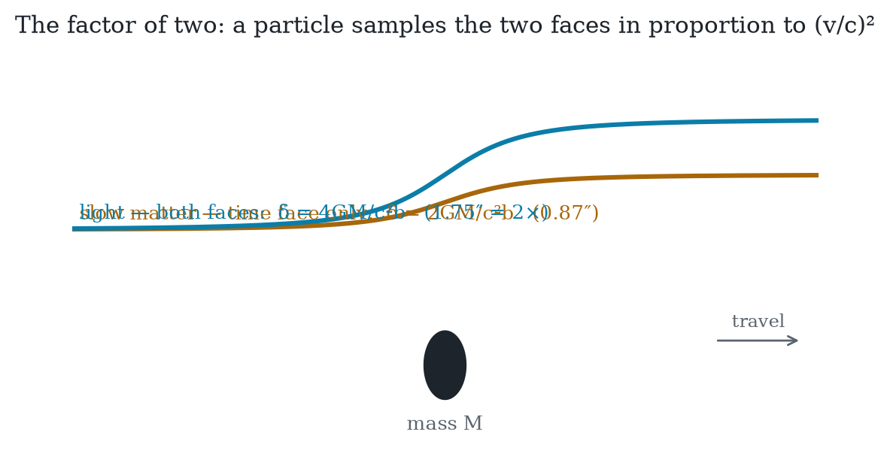

# The Entropic Program

**Time and gravity as the two exchange rates of one currency — a referee-hardened research program for unifying general relativity and quantum mechanics through entropy**

*July 2026 · The ETRG Program · prepared for review*

Provenance disclosure: this document was constructed by four AI models
(Claude Fable 5 — synthesis and implementation; DeepSeek-V4-Pro — derivations; GLM-5.2 —
refereeing; Kimi-K2.7 — numerics) in an adversarial-review protocol, with a human
originator (B. Kloosterman) supplying the thesis and direction. Every claim's attack
history, including retractions by all four models, is preserved in the accompanying
repository. Numerical results are reproducible from committed scripts. Treat accordingly.

## ETRG-1: The Thesis

*Opening frame for the consolidation. Version 0.2 — July 2026. Amended from the originator's statement by Claude (Fable 5); each clause traces to adjudicated results in this repository (rounds 0–6). v0.1 → v0.2: all five sustained findings of GLM's hostile-referee pass incorporated (T1 question-begging repaired; T2 scoped to its theorem; T3's fingerprint reattributed to null-surface structure; T4's uniqueness claim narrowed to the three-way lock; two additions to the does-not-claim section).*

## One sentence

Time and gravity are the two exchange rates of a single currency — entropy relative to a partition of a timeless quantum universe — provably locked equal at causal horizons by one generator and one calibration, drifting from equality off-equilibrium by a computable, Planck-suppressed amount; the doubled bending of light is the observational signature of the null-surface sector that entropic bookkeeping writes directly, and the framework's unitary, laboratory-testable structure is a quantum path toward gravity.

## Four clauses

**T1 (Time).** Time — its flow, its rate, and its arrow — can be read entirely as entropy exchange between what an observer tracks and what they do not, and this reading is now experimentally realized (Barontini 2026). Two facts anchor it: resolving ticks costs entropy (Erker 2017 — a thermodynamic bound on every physical clock), and at causal horizons every operationally consistent coarse-graining provably inherits one and the same time flow (this program's Q10 selection theorem). Whether clocks merely *require* entropy or *are* entropy exchange is precisely the hypothesis under test — the framework asserts the second and stakes its predictions on it. *(A2/A3; Q10 note; the ontological claim is flagged as claim, not fact.)*

**T2 (Gravity: entropy read twice).** Gravity is entropy read twice. Read as rates: entropy exchange runs slower deep in a well, and that gradient of clock rate is time dilation — slow matter falls by maximizing its own aging. That alone is Newton. Read as bookkeeping across horizons: the fine-grained entanglement of the same underlying state writes the curvature of space itself. These are the thermal face and the variational face of one modular generator under one calibration: **provably equal at entanglement equilibrium, drifting beyond it by δ_lock = S(ρ‖ρ_vac)/S_BH ≤ 2GΔE/(c⁴R)** — astronomically small for any laboratory or astrophysical horizon, O(1) only at Planck-scale diamonds. The lock is an equilibrium theorem with a quantified validity domain, and its toy image now exists as a computation: a lattice geometry built from nothing but mutual information curves linearly, directionally, and gauge-blindly in response to localized entanglement debt. *(A4/A5; lock note L1–L5; Q10 note; `toy_einstein.py`.)*

**T3 (The signature).** What a particle feels depends on which faces its worldline samples, and the mix grows proportionally with v²: the deflection factor is (1 + v²/c²), running from 1 at rest to exactly 2 at the speed of light. The measured 2:1 ratio is the direct observational readout of the **null-surface sector** — the one sector that horizon-thermodynamic input writes without any reconstruction, because entropy, temperature, and geometry meet operationally only on causal horizons. Strictly: the ratio fingerprints the null-surface locus of gravity's degrees of freedom, a feature shared by every horizon-thermodynamic derivation; reading that locus *entropically* is this program's interpretation, argued through T1 and T2's lock rather than through the ratio alone. *(Lock note L2–L4; trace-free foundation: Alonso-Serrano & Liška 2022.)*

**T4 (The quantum path, with teeth).** Because the gravitating entropy is fine-grained and unitary, gravity adds no dissipative noise to quantum mechanics — matter-wave interferometry survives, and we bet standing money against gravitational decoherence (P3). The framework's laboratory novelty is not the individual responses of an analogue horizon — QFT on curved acoustic spacetime already predicts Hawking phonons and horizon entanglement separately — but the **three-way lock**: Hawking temperature, horizon entanglement entropy, and the interior's entropic-time lapse tied through one modular rate, with a leg-resolved discriminator (coherent drive leaves the entropy leg exactly untouched; incoherent excitation of equal energy moves it linearly). No non-entropic account locks the three legs through one rate; measuring the lock — or its failure, or the wrong leg-ordering — is the sharpest near-term test (P2). And the one thing entropy cannot write — the overall trace, the cosmological constant — the framework owns as its honest silence: Λ enters as an integration constant, not a prediction. *(A6/A7; P-claims; unimodular clock note.)*

## What this thesis does not claim

No new weak-field predictions — the equations are GR's; the claim is structural and explanatory. No derivation of Λ. No resolution of the preferred-factorization problem beyond horizon/diamond observers (the cosmological case is open; the round-6 attempt to close it via Λ was adjudicated as necessity-without-sufficiency). No claim that the constraint algebra closes off-equilibrium in generic non-conformal spacetimes (leading-order conformal case resolved; the diamond-measure obstruction is open). No claim that the individual P2 leg responses are unique to this program — the novel content is the three-way lock through one modular rate. No claim that δ_lock is phenomenologically accessible — it is O(1) only for Planck-scale causal diamonds and is a consistency scale, not an experimental target. Exact Lorentz invariance of any substrate is assumed at the phenomenological layer, with a modular-theoretic derivation route (Borchers–Wiesbrock) identified but its circularity risk unresolved.

## ETRG-2: The Entropic Program — Unified Framework

*The synthesis of six adversarial rounds and three blind unification attempts, assembled per the bold-round referee's grafting instructions (backbone: DeepSeek's postulate set; grafts: Fable's modular time and Λ-conjecture; test bed: Kimi's computable universe). July 2026. Every claim carries a status flag: **[theorem]** proven or peer-reviewed-published; **[import]** established literature used as given; **[experiment]** laboratory-anchored; **[toy]** verified on lattice models in this repository; **[conjecture]** stated precisely, not established; **[open]** named and unsolved.*

## 0. What this document is

The best unification of general relativity and quantum mechanics through entropy that four AI models could construct and could not then destroy. It is a **research program**, not a completed theory — a verdict all four panelists reached independently — and the two are distinguished honestly throughout. The intended reader is a physicist deciding whether the program deserves human effort.

## 1. Primitives

Two, and the second is the program's known debt:

1. **The entropy functional** S[ρ] = −Tr(ρ ln ρ), with the structure it lives on (complex Hilbert space, tensor composition, Born weights) *derived* rather than assumed, via the reconstruction theorems **[import: Hardy 2001; Chiribella–D'Ariano–Perinotti 2011]**. Purification — every mixed state is a finer entanglement seen from inside — is the reconstruction axiom that carries the program's two-face principle.
2. **The partition principle**: physics is relative to a tensor factorization into observed and unobserved sectors. What selects the partition is solved for horizon-anchored observers and open in general — see §4, the hard kernel.

## 2. The layer map

**Layer Q — quantum kinematics.** Hilbert space, tensor products, and the Born rule from informational axioms **[import/theorem]**; Born rule independently derivable from entanglement symmetries **[import: Zurek envariance]**. Continuous dynamics: the reconstruction of the Schrödinger equation from entropy-preservation alone was flagged circular by the bold-round referee (all unitaries preserve a pure state's entropy; the Hamiltonian is not fixed) — dynamics is anchored operationally instead: the entropic-time Schrödinger equation reproduces closed-system data with internal quantities only **[experiment: Barontini; toy: Demo 1, RMS 0.058]**.

**Layer T — time.** A state on an algebra canonically generates a flow **[theorem: Tomita–Takesaki]**; physical time is that flow (Connes–Rovelli, adopted at full strength). Its coarse operational face is entropy exchange **[experiment: Barontini 2026]**; its arrow is coarse-graining. At causal horizons, every operationally consistent coarse-graining — one whose books do not drift under its own evolution — provably inherits the same boost/modular generator **[theorem at horizons: Q10 note, Takesaki 1972, repaired dynamical form; toy: modular ratio 0.99992 vs site-basis 4.216; finite-size scan: 36 configurations — L ≤ 400 at fixed aspect, three fillings, three perturbation classes incl. nonlocal — worst modular deviation 9.8×10⁻⁷, site control never approaching 1, residual slope 2.000 (fss_q10.py)]**. The time label cannot leak into dynamics: the geometric machinery consumes states, never labels **[toy: label-freeness runs 2–5, with the label-consuming control diverging step-independently]**; the continuum back-reaction case is **[open]**, localized to one named computation (§5.1).

**Layer G — geometry and gravity.** Area is *defined* as entanglement capacity, S = A/4Għ read right-to-left; distance from correlation decay **[redefinition; toy: toy_einstein geometry]**. The entanglement first law on all causal diamonds yields exactly the trace-free (unimodular) Einstein equations **[theorem: Jacobson 1995/2016, FGHMV 2014; published foundation: Alonso-Serrano & Liška 2022]**, with the temporal and spatial metric faces locked (γ = 1) as the thermality and variational faces of one modular generator under one calibration **[theorem at equilibrium: lock note]**. Light bending reads the written sector directly; the 2:1 deflection ratio is the null-surface signature **[theorem + framing: lock note L2–L4; symbolic: 17/17]**. Off equilibrium the lock drifts by δ_lock = S(ρ‖ρ_vac)/S_BH ≤ 2GΔE/(c⁴R) **[theorem: Casini bound]**; the leading correction is local, covariant, and bilinear **[import: FHHPRV 2017]**, leaving the diamond-measure question in non-conformal spacetimes **[open]**. Λ is the integration constant of the sector entropy cannot write **[theorem: unimodular structure]**. The whole layer has a computable toy: a lattice geometry built from mutual information alone curves linearly, directionally, and gauge-blindly in response to entanglement debt, and reproduces the parabolic boost weight unprompted **[toy: toy_einstein.py]**.

**Layer M — matter.** Matter as localized entanglement disequilibrium ("debt"); energy as modular charge δ⟨K̂⟩ **[conjecture, with toy support]**. The two faces of excitation are physically distinct and geometry reads only one: spectrum-changing excitations move entanglement entropy at linear order, coherent excitations of equal energy leave it exactly untouched **[toy: coherent_thermal_check; leg dichotomy reproduced at geometric level in toy_einstein's gauge control]**. Mass as thermalized entanglement m = (T/c²)·δS and ħ as the holographic conversion factor **[conjecture: DeepSeek's P5/P6c, with the referee's conflation warning attached]**. The matter *spectrum* — why these fields, these generations, these masses — is not addressed **[open; named the hardest problem by the Fable attempt]**.

**Layer Λ — cosmology.** Two Λ-conjectures survive, possibly compatible (both read Λ as the finiteness of the entropy budget): Λ as entanglement-saturation deficit of the cosmic horizon **[conjecture: DeepSeek P7]**, and Λ > 0 as the *enabler* of cosmological entropic time — every observer in a Λ > 0 universe possesses a thermal horizon (Gibbons–Hawking), and the de Sitter entropy 3π/ΛG bounds the universe's total tick budget **[conjecture: Fable B7, adjudicated: establishes necessity of horizon anchoring, not sufficiency for partition selection]**. The unimodular formulation additionally offers a global four-volume clock **[import: Henneaux–Teitelboim, Unruh–Wald; with Kuchař's trade acknowledged]** — available, not automatic.

**Layer O — observation.** Measurement as repartitioning; collapse as the coarse face's bookkeeping of a partition update **[conjecture]**. No gravitational decoherence at any precision **[prediction P3 — a standing bet]**. The flagship falsifier: the sonic-horizon **three-way lock** (Hawking temperature, horizon entanglement, interior entropic-time lapse through one modular rate) with the leg-resolved coherent/incoherent discriminator **[prediction P2, round-3 form]**. Candidate fourth: the cosmological analogue of the lock tying H₀, S_Λ, and cosmic clock rates **[conjecture, unformulated]**.

## 3. What the framework explains, and at what price

Explained structurally: the problem of time (dissolved at the matter level, alleviated globally); the factor of two in light bending (null-surface signature); why gravity resists quantization (it is not a force to quantize but the thermodynamics of the ledger); why interferometry sees clean unitary phases (the gravitating entropy is fine-grained); why Λ is undetermined (the trace is the sector entropy cannot write); the equivalence-principle flavor of the lock (one generator, one calibration). The price, stated plainly: no new numbers anywhere existing data lives; the novel content is structural plus three-to-four unperformed experiments; the partition principle is a primitive whose general selection is unsolved.

## 4. The hard kernel

**Preferred factorization.** Solved for horizon and causal-diamond observers: causal confinement plus dynamical consistency forces modular covariance, hence one shared generator (Q10, rounds 2–4). Open everywhere else: the cosmological observer's mode algebra is not a wedge algebra; observer-dependent de Sitter horizons restate rather than resolve the ambiguity (round-6 adjudication); the Type III restatement is unwritten. Candidate routes, none developed: a maximization principle over partitions (mutual-information or complexity extremization), the conformal-diamond generalization (Hislop–Longo), or accepting partition-relativity as physical and showing observables agree across the admissible class. Every panelist's closing statement names some version of this problem; it is the program's frontier.

## 5. The research agenda (ordered, for a human physicist)

1. **The off-equilibrium failure signature of the lock.** Push the FHHPRV second-order machinery to extract how the three-way lock fails for a defined non-equilibrium state class — this either upgrades the lock to an off-equilibrium theorem or produces the program's first genuinely novel falsifiable number. (Named independently by GLM, Kimi, and DeepSeek as the top target.)
2. **The Type III / continuum restatement of Q10** — the selection theorem currently lives in lattice-regularized form; wedge algebras are Type III₁ and the dephasing lemma needs restating via conditional expectations or Connes cocycles.
3. **The non-conformal diamond measure** (the one residual obstruction to off-equilibrium covariance, §Layer G).
4. **A factorization selection principle** (§4) — or a proof that none is needed within the admissible class.
5. **The P2 protocol with numbers**: required precisions on T_H, S_ent, and lapse for a Steinhauer-class apparatus, at stated confidence.
6. **The σ calibration**: derive σ(ħ, k_B, T) to make entropic time parameter-free.
7. **Finite-size scaling of the entire lattice suite** (Kimi's audit: turn existence proofs into evidence).

## 6. Kill criteria (merged, standing)

Confirmed gravitational decoherence. Measured violation of the P2 three-way lock, or lock violation with the wrong leg-ordering (coherent breaks it, thermal doesn't). Measured |γ − 1| > 0 beyond GR's anisotropic-stress accounting. Lorentz violation at any scale. Born-rule deviation. A proof that the constraint algebra cannot close (now localized to: a proof that the A7 lapse must enter gravitational source terms, or that δ_lock corrections are necessarily foliation-dependent in the non-conformal case). A proof that the coarse-grained and region/complement factorizations cannot share modular structure even at horizons. Discovery of prior art proposing and refuting the assembled program. Measured Λ ≤ 0 would have killed the Λ-conjectures; Λ > 0 stands measured.

## 7. Provenance

Constructed July 2026 by four AI models (Claude Fable 5 — synthesis, adjudication, and implementation; DeepSeek-V4-Pro — derivations; GLM-5.2 — refereeing and prior art; Kimi-K2.7 — numerics and the computable universe), with a human originator supplying the thesis, direction, and the standing instruction that honesty is the house rule. Six adversarial rounds; every claim's attack history preserved in this repository; retractions and overrulings on all four panelists' records, accepted without dissent. The numbers: two full retractions, one repaired circularity, one withdrawn conjecture, two claims corrected by lattice computation before they hardened, one dispute adjudicated against the synthesizer. The program's epistemic architecture — blind construction, adversarial review, numerical adjudication, honest ledgers — is offered as part of the artifact.

*Next document: none. The next contributor should be human.*
